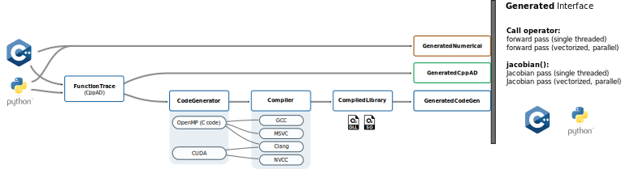

# Welcome to autogen

Code generation for automatic differentiation with GPU support.

This library leverages CppAD and CppADCodeGen to trace C++ and Python code, and turns it into efficient CUDA or C code.
At the same time, the Jacobian and Hessian code can be automatically generated through reverse-mode or forward-mode automatic differentiation.
The generated code is compiled to a dynamic library which typically runs orders of magnitude faster than the original user code that was traced,
while multiple calls to the forward or backward versions of the function can be parallelized through CUDA or OpenMP.
